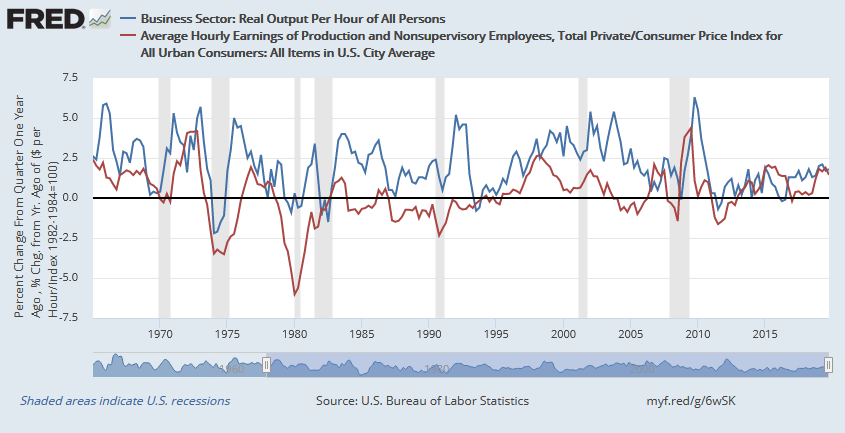

(Zimmermann, 2016)

​    

The above graph shows two lines. The blue line is real growth rates for average product and is supposed to be representative of MPN. The red line is average wage which is supposed to be representative of W. From this graph we can see that it is clear that the two lines are not closely related (Zimmermann, 2016). While this could be due to the substitutes being used impacting the relation, other causes could be that the market is less than perfectly competitive like it is assumed to be or the theory could of W = MPN could be wrong (Zimmermann, 2016). This graph indicates that there is a clear gap between W and MPN where the employer/business is benefitting from this difference because the growth rate of productivity is always above the growth rate of the wage. 

The US job market has employers, such as fast food restaurants, that have policies that wield some amount of monopsony power which could partially account for the gap (Mensik, 2018). Fast food restaurants are commonly known for paying minimum wage but the main reason they are able to pay minimum wage is because they can use contractual devices to suppress wages to the bare minimum (Mensik, 2018). One interesting phenomenon that these employers can face is that they have difficultly filling vacant positions but when they say this they really mean that they are not willing to raise the wage to a level that would attract someone to the position which is also shown again by the graph above that there is a discrepancy (Mensik, 2018). This highlights that the US job market might not be perfectly competitive and again diminishes part of the claim that W = MPN.

This seems to be leading to the idea that by increasing the minimum wage this would make minimum wage jobs more appealing however it is important to look at one more idea. Since it seems the theory of W = MPN is not entirely valid, lets take a look at the theory that MPN = W where having a higher wage increases a workers productivity because it motivates people to work harder. I do not think that the boost in morale is entirely the cause of the productivity increase. Rather, I think what is responsible for the increase is that firms realize it is more cost effective to invest in capital than labor because of the higher wage which in turns means less labor is hired and productivity is increased (Mason, 2017). What is important to note is that the technological possibility must exist so that this investment in capital can result in a productivity growth (Mason, 2017). This however is not a general law because there has been times in history such as the 1970s which would refute this argument so I believe under the right conditions the possibility for this exist (Mason, 2017).

I believe that increasing the minimum wage is not the proper way to go about fixing or reducing poverty in the US because it is essentially the shotgun approach to it. The minimum wage increase would impact many people but it would not be targeted enough to be actually helpful in targeting poverty. Poverty does not exist entirely because of low wages, some people are poor because of low hours or there is no one working in the family (Neumark, 2015). One of the biggest problems with increasing the minimum wage is that research shows that there would be a decline in employment (Neumark, 2015). While a some people would benefit from the increase in pay there are others who would lose their job which is a much worse outcome. Another point is that in 2012, 24% of minimum wage workers were teens (Wolla, 2014). This again means that poverty in particular is not being targeted by the minimum wage increase and the minimum wage increase is too general of an solution for poverty.

I believe a better solution to poverty than only increasing minimum wage is the earned income tax credit combined with a smaller minimum wage increase. The earned income tax credit is a subsidy to earnings for poor families and in particular families with children (Neumark, 2015). The EITC is better aimed at poor families and it encourages the people of poor families to enter the labor market which boost employment (Neumark, 2015). Also, since the EITC incentivizes working, it is much more likely that these families can earn their way out of poverty (Neumark, 2015). This combined with a small increase to minimum can yield much higher results in reducing poverty than if either one was done alone (Neumark, 2015).

References

Mason, J. W. (2017, August 12). Reading Notes: Demand and Productivity. Retrieved from https://jwmason.org/slackwire/reading-notes-demand-and-productivity/

Mensik, H. (2018, December 13). Illinois, 10 other states take aim at  'no-poaching' clauses that critics say limit fast-food workers' pay.  Retrieved from  https://www.chicagotribune.com/business/ct-biz-fast-food-non-compete-investigation-20180709-story.html

Neumark , D. (2015, December 28). Reducing Poverty via Minimum Wages,  Alternatives. Retrieved from  https://www.frbsf.org/economic-research/publications/economic-letter/2015/december/reducing-poverty-via-minimum-wages-tax-credit/

Wolla, S. A. (2014, March). Would Increasing the Minimum Wage Reduce  Poverty? Retrieved from  https://research.stlouisfed.org/publications/page1-econ/2014/03/01/would-increasing-the-minimum-wage-reduce-poverty/

Zimmermann, C. (2016, August 29). Testing theory: marginal product and  wages. Retrieved from  https://fredblog.stlouisfed.org/2016/08/testing-theory-marginal-product-and-wages/